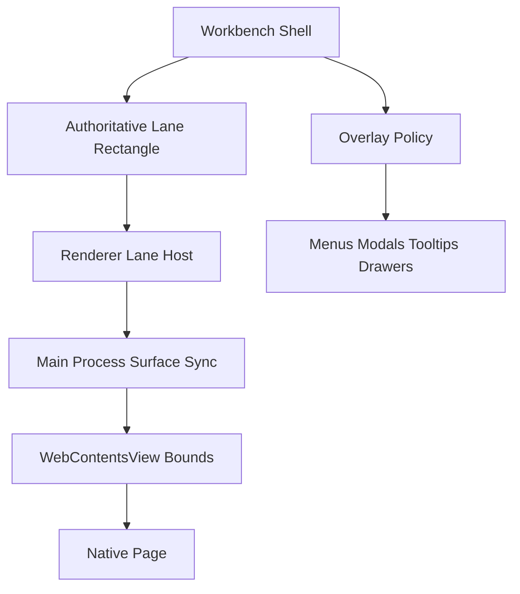

# Electron Native Browser Surface

This note is the canonical design and operations reference for embedding a native Electron browser surface inside Agency.

It exists because this area looks simple in screenshots and fails in ways that are not obvious in code:
- the page may render in the wrong place even when `loadURL` succeeds;
- the page may stay black even though the button click worked;
- renderer popovers can lose the z-order fight even when their DOM is correct;
- logs may stay empty if the failure happened before the native host ever received valid bounds.

The bounded web lane in Workbench is the current concrete implementation, but the rules here are intentionally more general. Any future native `WebContentsView` or similar embedded host should reuse the same geometry and layering model.

## Scope And Product Boundary

Agency is not trying to become a general browser product. The current product boundary stays:
- Explorer owns URL intake and launch.
- Workbench owns the browser-first lane and its adjacent research actions.
- The system browser remains the escape hatch for full browsing.

That boundary matters because host geometry, toolbar design, and layering rules all get worse when the product pretends this is "just another card with web content inside it."

The native browser surface should therefore read as a Workbench lane, not as:
- an Explorer drawer;
- a floating overlay with local geometry ownership;
- a generic browser window transplanted into Agency;
- a DOM card that happens to delegate part of its painting to Electron.

## What Finally Made It Render

The root cause of the "click `Go`, nothing happens" incident was not the `Go` button. The button fired. The failure happened earlier than `loadURL`.

The decisive evidence came from the packaged runtime log:
- renderer-side browser sync logs showed repeated `browser surface host rect unavailable`;
- the reported host rect had `width > 0` but `height = 0`;
- because height stayed `0`, the main process never received a usable surface rectangle;
- because the native host never got valid bounds, the flow never reached meaningful `loadURL` work.

The actual mistake was geometric, not navigational:
- the live host was treated like content inside a normal renderer card;
- the browser lane relied on auto-height / descendant height propagation;
- the native host itself was an absolute-filled child without a sufficiently authoritative containing block;
- in packaged runtime, that chain collapsed into a host element whose width existed but height did not.

The fix that unblocked rendering was correspondingly geometric:
- make the browser lane a stable, explicitly bounded shell region;
- make the live host fill that region, instead of expecting flex or percentage height to infer it;
- keep the authoritative containing block on the Workbench lane frame, not on incidental descendants.

This is the reason the page started rendering after `344e885`.

## Failure Modes We Hit

Three independent classes of failure showed up during this work, and mixing them slowed debugging.

### 1. Wrong host technology

The first implementation path used a renderer `iframe`.

That failed for exactly the reasons Chromium is supposed to fail:
- `frame-ancestors 'none'`;
- `X-Frame-Options`;
- sites like GitHub refusing to be embedded.

This was not a bug in GitHub, and not something we should "work around" by header rewriting. It was the wrong host model for a browser lane.

### 2. Correct host type, wrong geometry owner

Moving to `WebContentsView` solved CSP/iframe denial, but introduced a different category of failure:
- the browser surface became a top-level native child of the window;
- the renderer still behaved as if it were painting ordinary DOM content;
- geometry truth stayed local to tab content instead of being treated as shell-owned lane geometry.

This is where offset rendering, black lanes, and "it works after retry / resize / tab switch" behavior came from.

### 3. Logs in the wrong stage

Early logging was attached too late in the chain.

That made packaged failures look mysterious, because:
- there were no `loadURL` failures;
- therefore it looked like the button or IPC path had broken;
- in reality, sync never got past host availability or usable bounds.

The durable debugging rule is:
- if there is no browser-lane log, do not assume the lane is healthy;
- instead assume the failure happened before native navigation, and instrument host-sync stages first.

## Canonical Host Model

The correct mental model in Agency is a workbench-owned viewport host plus an explicit renderer-view native seam, not renderer-owned layout with native paint grafted into it.

The responsibilities are:

### Workbench shell

The shell/workbench layout owns:
- which tab currently owns the native surface;
- whether the lane is visible;
- one authoritative viewport host for the lane;
- whether another surface temporarily suspends or occludes the lane.

### Renderer lane host

The renderer host owns:
- one stable viewport host rendered by the Workbench layout owner;
- reporting viewport geometry changes to the main process;
- exposing state to browser chrome and research controls;
- never pretending that CSS alone is the source of truth for native layering.

### Main process native host

The main process owns:
- native surface creation and disposal;
- `setBounds`, `show`, `hide`, and navigation lifecycle;
- browser history affordances;
- protection against external top-level navigation and invalid URLs;
- rejecting browser placement when the renderer-view seam is unavailable instead of trusting raw renderer coordinates.

### Research UI

Research actions remain adjacent, but subordinate:
- `Open in Browser`;
- `Save Markdown`;
- `Cite`;
- Reader text / handoff state.

They are part of the Workbench object model, not part of the native surface host contract itself.

## Reusable Design Going Forward

The next step should not be more one-off browser-lane fixes. It should be a reusable native-surface host design.

The reusable abstraction should have two layers.

### 1. Native surface lane host

This is the reusable geometry and lifecycle primitive.

It should package:
- one workbench-owned viewport host;
- sync throttling / retries / logging;
- main-process attach/show/hide/update/dispose;
- explicit visible vs suspended semantics;
- fail-closed mapping when the renderer-view seam is unavailable.

This is the part future embedded surfaces should reuse directly.

The preferred reusable seam is:
- Workbench layout renders one authoritative viewport host for the native lane;
- renderer reports that viewport host rect exactly once, instead of relaying measurements through nested browser fragments or shell proxy hosts;
- main process resolves renderer-view native bounds through `getRendererViewBounds()` or the owner renderer child view;
- main process maps viewport geometry into native content-space geometry with `mapRendererRectToNativeContentRect()`;
- invalid or unresolved mapped geometry hides the native surface instead of preserving stale placement or trusting raw renderer coordinates.

In the current BrowserWindow-based shell, the seam resolves in this order:
- an explicit `getRendererViewBounds()` owner seam when one exists;
- the owner renderer child view if Electron exposes it through `contentView.children`;
- the BrowserWindow content-area local rectangle `{ x: 0, y: 0, width: contentWidth, height: contentHeight }` as the deterministic BrowserWindow fallback.

The important rule is not which of those three wins; it is that the browser service no longer guesses by trusting raw renderer coordinates.

### The One Correct Integration Pattern

For Agency's current hybrid renderer/native shell, the only correct integration pattern is:
1. Workbench owns one authoritative viewport host for the browser lane.
2. The renderer reports that viewport host rect directly, exactly once.
3. The main process resolves renderer-view native bounds through the explicit seam (owner seam, renderer child view, or BrowserWindow content-area fallback).
4. The main process maps the viewport host rect into native content-space bounds.
5. If that seam or mapped geometry is invalid, the native surface hides or suspends instead of preserving stale placement.

Anything else is the wrong shape and should be rejected, including:
- measuring a nested browser fragment and relaying that rect upward;
- measuring one DOM host, then projecting it into another shell proxy host, then measuring again;
- trusting raw renderer coordinates without a renderer-view seam;
- preserving stale native bounds when shell geometry or seam resolution becomes invalid.

### Why This Is Not cmux

`cmux` appears to avoid much of this pain because its browser panel is part of a native pane system.

Agency is different today:
- the application shell and Workbench chrome still live in the renderer DOM;
- the browser lane is a native `WebContentsView`;
- therefore one renderer/native seam is unavoidable unless the entire shell moves to a native pane tree.

The right goal in Agency is not "no DOM measurement ever." The right goal is:
- one authoritative Workbench-owned viewport host;
- one explicit renderer-view native seam;
- zero projected relays through nested browser fragments or raw renderer-bounds fallbacks.

### 2. Native surface overlay coordinator

This is the layer we do not fully have yet, but now clearly need.

It should define how native surfaces interact with renderer overlays such as:
- menus;
- modals;
- context menus;
- tooltips;
- drawers or floating command surfaces.

The key design point is that native surfaces and DOM overlays do not share one compositing model.

So the coordinator needs an explicit policy, for example:
- overlays that must always win can temporarily suspend or hide the native surface;
- overlays that may overlap visually can be routed through a native-friendly layer owner;
- popovers local to the lane must declare whether they are above the browser lane, clipped inside it, or should trigger temporary occlusion.

If this stays implicit, every new popover will rediscover the same "why is the browser covering my UI" problem.

## Rules That Prevent Regression

The practical rules are short.

### Geometry

- The native browser host must be anchored to one stable Workbench-owned viewport host.
- Do not relay geometry through nested browser fragments, shell proxy hosts, or percentage-height descendants.
- If logs show `width > 0` and `height = 0`, treat that as a host-geometry failure, not a navigation failure.
- Prefer an explicit renderer-view bounds seam; if discovery cannot resolve renderer-view bounds, fail closed instead of trusting raw renderer coordinates.

### Layering

- Never assume a renderer popup will naturally out-layer a native surface.
- Declare whether an overlay suspends the lane, coexists with it, or must be hosted through a different native layer path.
- Keep layer ownership centralized; do not let each feature invent its own native-surface occlusion behavior.

### Debugging

- Instrument both renderer sync stages and main-process navigation stages.
- Distinguish "button did not fire" from "sync never produced valid bounds" from "navigation failed."
- Use packaged runtime logs as the source of truth for packaged behavior.

### Product posture

- Keep browser controls primary and research controls secondary.
- Keep the lane browser-first, but bounded.
- Do not turn a bounded lane into a generic multi-tab browser product just because the host is native.

## Anti-Patterns We Should Reject

These shortcuts are attractive and wrong:
- reintroducing an `iframe` because it feels easier to align;
- treating a native surface like normal DOM content and hoping flexbox will imply the right bounds;
- letting each browser tab own its own ad hoc native geometry logic;
- solving overlay conflicts with random z-index escalation in renderer CSS;
- mixing browser controls and research actions into one undifferentiated toolbar;
- declaring success once the page loads on one machine, without packaged-runtime logs and geometry evidence.

## Current References

- Runtime host + navigation owner: `apps/editor/electron/services/workbenchBrowserSurface.ts`
- Workbench lane owner: `apps/editor/renderer/src/components/workbench/WorkbenchPane.tsx`
- Shell main-panels container: `apps/editor/renderer/src/components/layout/AppMainPanels.tsx`
- Renderer host sync: `apps/editor/renderer/src/components/workbench/useWorkbenchBrowserSurface.ts`
- Browser lane view shell: `apps/editor/renderer/src/components/workbench/WorkbenchBrowserLane.tsx`
- Bounded web scene + chrome: `apps/editor/renderer/src/components/workbench/WorkbenchBoundedWebResearchView.tsx`
- Workbench lane owner: `apps/editor/renderer/src/components/workbench/WorkbenchPane.tsx`
- Incident memory: `docs/.bagakit/inbox/gotcha-browser-surface-host.md`
