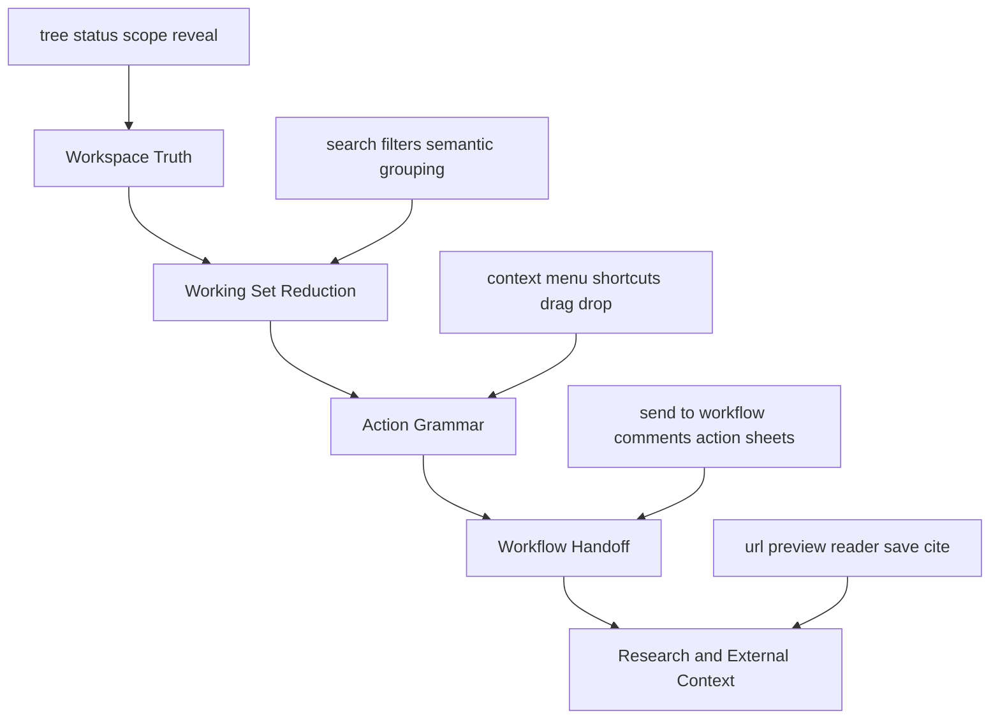

# Explorer Interaction System

This note is the dedicated design reference for Agency Explorer.

It sits below `docs/notes-file-interaction-system.md`:
- `notes-file-interaction-system.md` defines the cross-surface contract and system philosophy.
- this note defines what Explorer itself should be as a product surface: what it owns, what it should not own, and what “excellent” looks like.

## Why Explorer Needs Its Own Design Doc

Explorer is no longer “just a file tree”.

In Agency, it is simultaneously:
- the canonical file mutation hub;
- the most legible file-status surface;
- a reveal target for other surfaces;
- a launch point for file-scoped workflow actions;
- a likely future host for richer file-semantic and URL-research flows.

That combination creates a design risk: once a surface becomes both powerful and central, it can easily degrade into a pile of useful widgets that no longer reads like one system.

This doc exists to keep Explorer opinionated.

## Current Strengths We Should Preserve

Agency Explorer already has several strong traits that should be kept as non-negotiable foundations.

### Shell-owned sidebar control

Explorer lives inside the shared left dock. That means collapse and expand should belong to shell chrome, not to Explorer-local edge handles or per-surface corner buttons.

Current boundary:
- Activity Bar owns left-sidebar collapse and expand;
- `SidebarDock` owns width and resize only;
- Explorer header should not spend precious title-row space repeating shell-level collapse affordances.
- Explorer header should read as calm file-context chrome, not as a second surface competing with the tree itself.

### One execution hub, not many ad hoc file UIs

The current architecture already treats Explorer as the canonical execution hub for file mutation and reveal, rather than letting every surface invent its own file behavior.

This is a strong choice and should remain the default.

It gives Agency:
- one safety model;
- one error/result model;
- one drag/import contract;
- one future process boundary for tool/agent callers.

### Strong filter and semantic baseline

The current filter system is already more serious than a typical “show hidden files” toggle set.

It combines:
- visibility controls;
- Git-derived status filtering;
- project-extended semantic filtering;
- persisted per-root filter preferences.

That means Explorer already understands that “file browsing” is not just path traversal; it is contextual reduction of a large workspace into a task-relevant working set.

### Good split between orchestration and execution

The current implementation quality is good at the hook/module boundary.

We already have:
- `useProjectExplorer` for tree/search/watch/status orchestration;
- `useExplorerEntryMutations` for create/rename/delete/move;
- `useExplorerClipboardActions` for copy/cut/paste/materialize;
- `useExplorerDropHandlers` and related helpers for drag/drop.

This is exactly the right direction.

It means future Explorer growth should prefer adding bounded modules, not inflating one god component.

### Selection actions are now explicit

Explorer now exposes file-scoped workflow actions through an explicit `Selection Actions` rail instead of pretending they are just another tree row affordance.

This is an improvement in product honesty.

It makes a hard distinction:
- the tree is for browsing and manipulating files;
- the action rail is for using those files as workflow context.

That distinction should remain visible.

## External Research

The goal of this research is not to copy VS Code or Obsidian mechanically.

The goal is to understand what a high-efficiency editor Explorer must do, where the boundary of the surface should be, and which capabilities deserve to become first-class in Agency.

### VS Code

VS Code is strong not because its Explorer is flashy, but because the Explorer is deeply integrated with the rest of the workbench.

Important patterns from official docs and UX guidance:
- the Explorer is one view inside a broader sidebar/view-container system, and VS Code explicitly warns against too many views or actions in one sidebar container;
- tree views should be used for data display, with clear labels and limited per-item actions;
- context menus should be contextual, grouped consistently, and avoid showing irrelevant actions everywhere;
- explicit reveal actions matter: `explorer.autoReveal` can be disabled, and `Show Active File in Explorer` exists as a separate command;
- breadcrumbs, quick navigation, and quick-open reduce the need to overburden the tree itself with every navigation task.

What this means for Agency:
- Explorer should stay integrated, but not overloaded;
- explicit reveal is valuable and should remain first-class;
- too many persistent sidebar widgets is a known failure mode, not a sign of power;
- action density should be controlled at both row and surface level.

### Obsidian

Obsidian is useful here because it is not primarily an IDE, yet its file and note navigation model is highly productive.

Important patterns from official help docs:
- File Explorer is a core plugin, not a special case hack; it supports create/delete/rename/move/context menu/drag-and-drop as part of the normal note workflow;
- Quick switcher is keyboard-first and scales to large vaults with behavior changes for performance;
- Workspaces preserve layout state based on task context;
- Web viewer intentionally exists as an in-app research fast path, but Obsidian is explicit that it is not a full browser replacement;
- file operations and knowledge operations are linked: rename updates links, drag-drop can create links, and note context tools such as backlinks/tags/properties are treated as native adjacent surfaces.

What this means for Agency:
- Explorer should support file-system truth and knowledge/workflow truth together, not pick one;
- task context matters enough to justify saved layout and scope state;
- integrated web research is valuable if it accelerates note/file workflows without pretending to be a general-purpose browser;
- workflow-adjacent surfaces should feel like siblings of Explorer, not bolted-on overlays.

### cmux and URL Browser

`cmux` is worth studying.

Not because Agency should become a terminal multiplexer clone, but because `cmux` treats browser access as a practical coding-agent workflow primitive rather than a separate app context.

The useful idea is not “put a browser everywhere”.

The useful idea is:
- let the user or agent open a URL inline when it is part of the current task;
- keep that browser context close enough to the workspace that information can be inspected, copied, and turned into repo-local artifacts quickly;
- treat web access as an acceleration path for code/research workflows, not as a full browsing environment.

Obsidian’s Web viewer reinforces the same conclusion:
- integrated browser-like capability is valuable for research;
- it should be positioned as a quick research surface, not as a replacement for the system browser;
- security and capability boundaries must stay explicit.

So yes: the `cmux` URL browser idea is worth borrowing.

But Agency should borrow the workflow principle, not the entire product posture.

## Capability Model for an Excellent Editor Explorer

An excellent Explorer in a modern text editor should cover five capability layers.

### 1. Workspace Truth

Explorer must remain the fastest place to answer:
- what exists;
- where it is;
- what changed;
- which scope I am looking at.

This is the non-negotiable base layer.

If this layer becomes noisy or ambiguous, everything above it suffers.

### 2. Working Set Reduction

A good Explorer does not only show the full tree.

It must help the user reduce a large workspace into the relevant subset.

That includes:
- search;
- file-status filtering;
- semantic filtering;
- grouped “changed files” views;
- quick locate/reveal.

This is where Agency is already on a strong path.

### 3. Action Grammar

A great Explorer has a consistent action grammar:
- what happens on single click;
- what happens on double click;
- what actions belong in the row;
- what actions belong in the context menu;
- what actions belong in the header;
- what actions belong in a separate rail.

This is not just about implementation.

It is about making action location predictable.

### 4. Workflow Handoff

Agency should be better than typical editors here.

Explorer should not stop at “open the file”.

It should also let the user:
- select files as context;
- preview the selected set;
- dispatch that context into Action Sheets / sessions / replies;
- move between file truth and workflow truth without friction.

This is where Agency can exceed VS Code, as long as the workflow rail stays subordinate to the tree rather than replacing it.

### 5. Research and External Context

A next-generation Explorer should understand that some file work starts from URLs, docs, and external references.

That does not mean “become a browser”.

It means:
- support opening URLs inside a bounded research surface;
- make it easy to save, quote, cite, or convert that content into repo-local artifacts;
- keep the path from web context to file artifact short.

This is the right place to borrow from Obsidian Web viewer and `cmux` URL browser.

## What Agency Explorer Still Needs

The current gaps are not primarily about missing CRUD.

They are about turning a strong implementation into a stronger product system.

## Delivered Platform Baseline

The Explorer is now implemented as a capability platform rather than only a sidebar tree.

### 1. Filter descriptor registry

Built-in filters now live behind stable descriptor ids instead of only ad hoc UI state.

Current built-ins:
- `visibility.hidden`
- `visibility.ignored`
- `visibility.changesOnly`
- `status`
- `semantic`

Practical consequences:
- persisted filter state is keyed by descriptor id;
- legacy persisted state is still read during migration;
- project policy can provide default descriptor values without replacing user-local overrides.

### 2. Command registry for header and context menu

Explorer header actions and context-menu actions are now declared through one registry.

Current registry responsibilities:
- command id / label / icon / group;
- surface placement (`header`, `context_menu`);
- `when` visibility predicate;
- disabled-state predicate;
- routing into existing file-intent and workflow handlers.

This keeps the execution layer unchanged while making future action growth cheaper.

### 3. Search capability split

Explorer now treats path/name search and content search as different capabilities.

Path search:
- remains the lightweight tree-reduction model;
- drives the canonical tree directly.

Content search:
- runs as a dedicated surface with scope + modifier controls;
- returns file matches with line-level evidence;
- supports explicit replace with confirmation before mutation.

Current content-search guardrails:
- candidate files come from tracked + untracked repo files;
- binary files are skipped;
- large files are skipped once they exceed the host-side size cap;
- invalid folder/selection scopes are rejected by the host instead of silently widening to project scope;
- replace runs only against explicitly confirmed targets and reports failures/skips;
- when replacement text is present, the result surface previews how confirmed snippet lines would change so replace review is not limited to raw search evidence;
- files with more total matches than the visible evidence list stay replaceable only through explicit full-file confirmation, rather than pretending the visible subset is exhaustive.

### 4. Working-set view family

`Changed Files` is now a first-class Explorer working-set view instead of a one-off companion panel.

Current model:
- canonical tree remains the default working surface;
- `Changed` is the first registered working-set view;
- future members (`semantic`, `recent`, `session-relevant`) already have reserved ids in the registry, even if they are not yet implemented;
- each working-set descriptor now declares its own supported search modes, content-search scope kinds, and whether tree-filter affordances remain valid.

Practical boundary:
- non-tree working-sets do not inherit tree-only selection/folder search scope implicitly;
- `Changed Files` currently allows project-wide content search only until it gains its own explicit working-set-local scope model.

### 5. Project-level Explorer policy

Explorer now loads project defaults from `.agency/explorer.yaml` / `.agency/explorer.yml`.

Current policy surface:
- default filter descriptor state;
- default working-set view;
- working-set option ordering;
- default search mode;
- default content-search scope + flags;
- command visibility policy;
- research-lane enablement / handoff allowances.

Override precedence:
1. built-in defaults
2. project policy defaults
3. user-local persisted UI state

The project policy currently governs defaults, working-set option exposure/order, and command visibility. It still does not define named Explorer presets or saved named search queries. That is deliberate: both should wait until there is a stronger product contract for reusable starting states rather than becoming a second hidden configuration system.

What is active now:
- `workingSet.presets` can reorder registered working-set entries without hard-coding a new branch in `ProjectExplorerSidebar`;
- `actions.hiddenCommands` can remove registered header/context-menu commands without mutating the command registry itself;
- project policy still cannot redefine file-intent behavior or turn bounded web research into a general browser surface.

### 6. Bounded URL intake

Explorer now exposes bounded URL intake and Workbench now hosts the primary bounded web research surface rather than assuming all URL work belongs in another app.

Current model:
- `URL` is a first-class Explorer search mode alongside `Paths` and `Content`, not a hidden header utility;
- the shared Explorer search row owns URL intake and can surface a compact `Open Web` affordance when the current input already looks like a supported public URL;
- Workbench opens a bounded web research tab that owns the primary page/research surface and its actions;
- `View` is a native browser surface rather than a renderer iframe, so browser-denied sites still render while the Workbench tab remains the owning object;
- saved Markdown files keep fixed `agency_source_*` frontmatter so Workbench can reopen them in markdown + preview mode;
- citations still route through Memo/HIL, and full browsing still escapes to the system browser.

Presentation boundary:
- Explorer owns discovery, intent selection, and launch/focus into the bounded web flow;
- Workbench owns reading, reload/open-browser/save/cite actions, and linked markdown preview;
- the product still does not grow tabs, cookies, auth state, or browser-global session management inside Agency.

Security/scope boundary:
- only `http/https`;
- local/private hosts are rejected by the shared public-URL policy in both renderer intake and native browser-host navigation;
- the lane is for URL -> workspace/workflow handoff, not arbitrary browsing;
- the lane does not own tabs, cookies, auth/session state, or a window-global webview.

### Row State Language

The Explorer left-tree list is the canonical file view, so each row needs a predictable state hierarchy instead of competing cues. The hierarchy starts with direct user intent (keyboard focus, selection, multi-select context, drag/drop targets), then moves to visibility controls (hidden, ignored, working-set filters) so that toggles remove rows without reassigning focus or selection, and finally lands on semantic metadata (git status, cell attribution, search matches) that stays readable but does not hijack the interaction.

Ignored-entry treatment belongs squarely in that visibility layer: when `visibility.ignored` is disabled the rows disappear, but their row state (selection/focus/multi-select) stays preserved so re-enabling the filter immediately reconnects to the same row rather than auto-selecting a neighbor. When ignored entries are exposed the row should still honor the higher-priority state (for example, selection and focus keep dictating available commands) even while the row continues to surface its ignored metadata, which keeps reveal/open flows and Action Sheet dispatch consistent with tracked files.

That means ignored rows should be de-emphasized, not visually “crossed out” as if they were deleted or broken. The row still needs to read like a valid, actionable file row. In practice the file name should stay legible, the ignored cue should be lighter than selection/focus, and row metadata should collapse to the most important workbench state instead of stacking equal-weight badges that compete with the file name.

### Header Hierarchy

The Explorer header exists to frame the current file scope, not to become a second surface above the tree. It should compress title, search mode, filter state, and utility actions into calm chrome that the user can read quickly and then ignore. The header is successful when the file rows remain the first thing the eye reads after opening Explorer.

That means:
- shell-level collapse/expand stays outside the header;
- root/context labels should read as one quiet context line instead of stacked hero copy;
- search/filter/working-set controls should stay legible without turning into a row of equally loud pills;
- the list itself, not the header, remains the primary visual surface.

### Validation Notes

Current validation baseline:
- renderer typecheck for the new platform seams;
- renderer unit coverage for descriptor normalization, command visibility, and existing Explorer row/footer semantics;
- host-side tests for project policy loading plus content search / replace;
- e2e regression for switching between canonical tree and the `Changed` working-set view;
- e2e regression for the `Changed` working-set switching search layering to content-search and hiding tree-only filters.

Recommended manual checks before shipping larger follow-up changes:
- switch between `Tree` and `Changed` views and confirm footer workflow behavior remains stable;
- run a scoped content replace in a disposable repo and confirm target-count review + failure reporting, including the full-file confirmation path for files with hidden matches;
- inspect a public URL in the research lane, save Markdown into the workspace, and confirm `Open in Browser` escapes correctly;
- add a handoff note, then confirm the saved Markdown and created memo citation both preserve that note;
- try a localhost/private URL and confirm the bounded reader rejects it instead of silently becoming a general browser.

## Remaining Next Steps

### Near-term

1. Add more working-set families only when they earn their place in the Explorer, not as speculative tabs.
2. Revisit named Explorer presets only after more than one real reusable starting-state workflow exists; the earlier standalone preset proposal was intentionally dropped as premature.
3. Tighten keyboard-focused coverage for the content-search and research-lane flows.

### Strategic

1. Let agent workflows call the same search/working-set/research seams through host-governed capability wrappers.
2. Add richer repo-aware project policy once real project-specific Explorer customization emerges.

## Source Links

Primary references used in this research:
- VS Code code navigation and breadcrumbs: https://code.visualstudio.com/docs/editing/editingevolved
- VS Code sidebar UX guidelines: https://code.visualstudio.com/api/ux-guidelines/sidebars
- VS Code views UX guidelines: https://code.visualstudio.com/api/ux-guidelines/views
- VS Code context menu UX guidelines: https://code.visualstudio.com/api/ux-guidelines/context-menus
- VS Code `explorer.autoReveal` and explicit reveal action: https://code.visualstudio.com/updates/vApril
- Obsidian File explorer: https://help.obsidian.md/Plugins/File%20explorer
- Obsidian Quick switcher: https://help.obsidian.md/plugins/quick-switcher
- Obsidian Workspaces: https://help.obsidian.md/Plugins/Workspaces
- Obsidian Web viewer: https://help.obsidian.md/plugins/web-viewer
- Obsidian core plugins overview: https://help.obsidian.md/plugins
- Obsidian drag and drop: https://help.obsidian.md/drag-and-drop
- Obsidian note management: https://help.obsidian.md/manage-notes
- cmux repository: https://github.com/manaflow-ai/cmux
