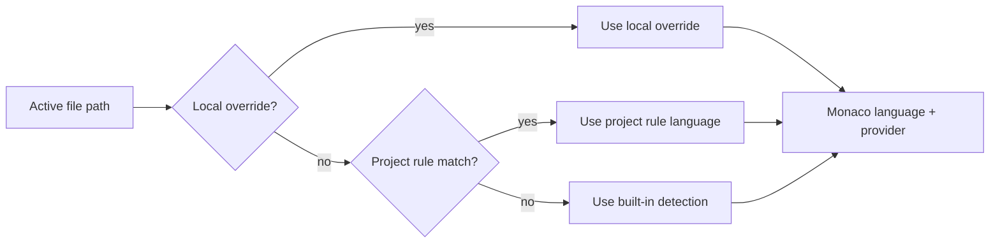

# Workbench Highlighting System

This note defines the Workbench highlighting architecture: how Agency decides a file's editing language, where repo policy fits, where local override fits, and which future directions are intentionally deferred.

## Why This Needs A Dedicated Note

Syntax coloring looks deceptively small.
In practice it crosses several ownership boundaries:
- file classification and edit safety;
- repository conventions;
- local corrective intent;
- editor runtime/provider wiring.

If those boundaries blur, Workbench grows the wrong kind of complexity:
- file heuristics leak into UI components;
- local overrides become hidden repo mutations;
- “pick a tokenizer” gets confused with “this file is safe to edit”.

This note exists to prevent that drift.

## Design Goals

### 1. One explicit language decision chain

Agency should never make users guess which language authority won.

The effective Workbench language must resolve in this order:
1. local manual override
2. project-level Workbench policy
3. built-in filename/extension detection

The current source should remain legible in the UI.

### 2. Secure kind stays separate

Workbench language choice is not the same as secure editability.

`code`, `vector`, `image`, `video`, `audio`, `pdf`, and `unknown` remain the safety gate.

Language override may refine how a text-capable model is tokenized.
It must not silently upgrade an `unknown` file into a normal editable code tab.

### 3. Repo policy and local override have different owners

Project policy is repo-owned.
It expresses stable team or repository conventions.

Local override is user/window-owned.
It expresses corrective intent for the current environment and should be resettable without mutating repo state.

That distinction is non-negotiable.

## Target Resolution Model



## Current Foundation

Current shipped foundation in this change:
1. local manual override from window-local UI state
2. project-level Workbench policy
3. built-in detection

The current Workbench UI now surfaces the active language source (`Auto`, `Project Rule`, `Local Override`) inside the document-local language control.

## Current Provider Boundary

This slice keeps Workbench on a Monaco-first provider model:
- Monaco built-in language ids where available;
- project-owned custom Monarch registrations where Monaco lacks a built-in id;
- `plaintext` as the safe fallback.

This is deliberate.

### Deferred on purpose

The following are explicitly not part of the current slice:
- TextMate grammar loading;
- tree-sitter parsing;
- LSP semantic tokens.

These are likely future layers, but they should sit on top of a stable language decision system rather than replacing it.

## Project Policy Contract

Project-level Workbench language rules live in:
- `.agency/workbench.yaml`
- `.agency/workbench.yml`

Current shape:

```yaml
languages:
  overrides:
    - match: "Tiltfile"
      language: python
    - match: "**/*.env.local"
      language: dotenv
```

Notes:
- `match` uses one shared path matcher contract.
- patterns without `/` are treated as basename-oriented matches;
- unsupported language ids are ignored safely;
- project rules affect language choice, not secure-kind classification.

## UI Expectations

The Workbench language control should feel like file context, not settings chrome.

That implies:
- show it in the Workbench itself, near the current file status;
- keep it compact and immediately understandable;
- show whether the current language came from auto detection, a project rule, or a local override;
- allow reset to automatic mode without ceremony.

It should not:
- open a heavyweight settings flow for one file-level decision;
- silently rewrite repo config;
- introduce a second, disconnected language system outside Workbench.

## Technical Seams We Want To Preserve

- shared Workbench language core:
  supported language ids, labels, rule matching, and normalization belong in one SSOT module
- Workbench file-type classification:
  secure kind and built-in detection stay together, but they do not own project/manual overrides
- project policy service:
  read + normalize `.agency/workbench.yaml` on the main side through one bounded service
- Workbench language decision layer:
  combines local override, project policy, and built-in detection into one explicit result object
- Monaco integration:
  custom language registration stays centralized and is applied before editor mount

## Rejected Directions

### “Just keep adding more file heuristics”

Rejected because it distributes authority into whichever component was easiest to patch that day.

### “One click should write repo config immediately”

Rejected because local corrective intent and repo-owned policy have different owners and review expectations.

### “Language override should unlock any file”

Rejected because tokenizer selection and safe editing are different concerns.
