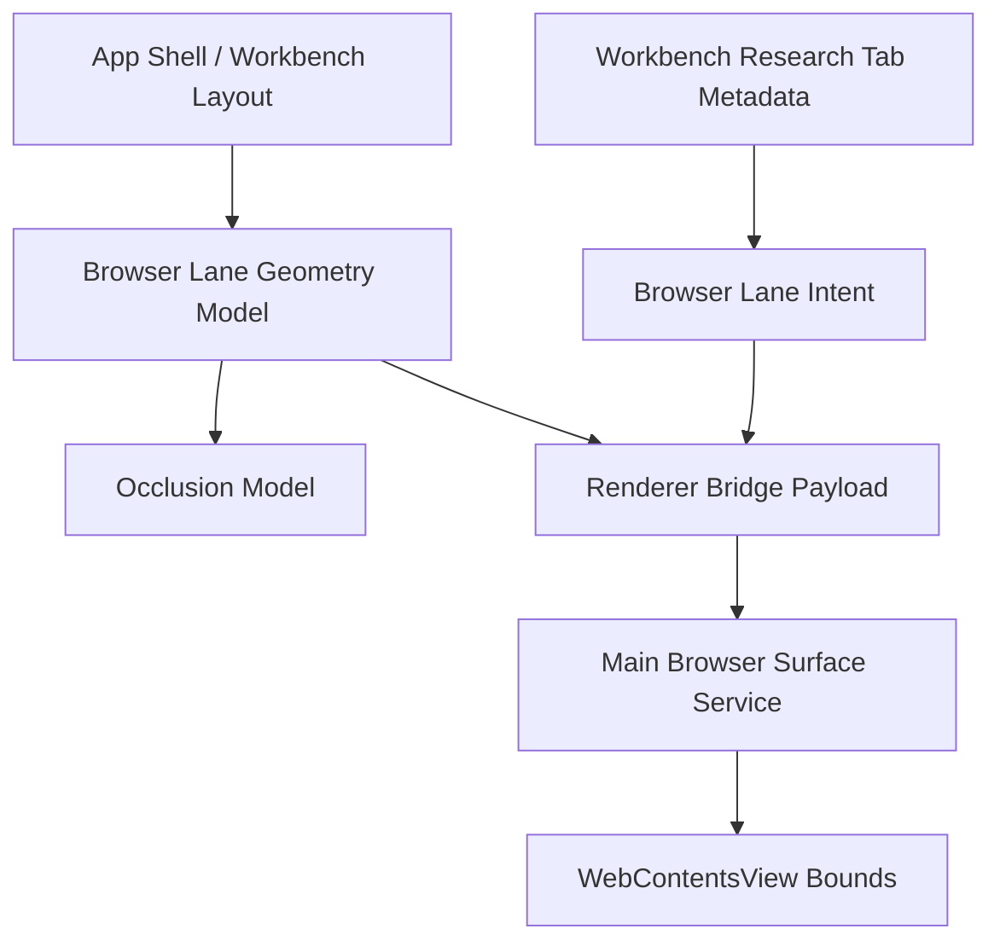

## Context
The current bounded browser lane already established the right product noun:
- Explorer owns intake;
- Workbench owns the research object;
- `View` is native;
- `Reader` and research actions remain bounded.

What is still wrong is the ownership model for placement. A tab-local renderer fragment still measures the browser host and projects that measurement into the main process. That means shell siblings affect the browser lane indirectly and reactively instead of through one authoritative pane contract.

## Goals / Non-Goals
- Goals:
  - make browser-lane geometry a shell/workbench concern instead of a tab-local DOM concern;
  - make native browser occlusion behavior explicit for shell siblings and overlays;
  - preserve bounded web research semantics while removing projected-host fragility.
- Non-Goals:
  - no general browser product;
  - no browser-global tabs/history/downloads/cookies UI;
  - no rewrite of Reader/save/cite object semantics;
  - no dependence on hidden Electron implementation details as the long-term SSOT.

## Decisions
- Decision: introduce one shell-owned browser lane rect contract.
  - Why: the shell already owns sidebar width, attention rail, HIL drawer, title bar, and main panel massing. Browser lane geometry must be derived at the same layer.
- Decision: tab-local browser hosts may remain as fallback anchors or debug affordances, but they are not the authoritative native placement owner.
  - Why: a nested host is useful for renderer-local state and testing, but it is not the correct owner for a native pane.
- Decision: native browser visibility must include an explicit occlusion state.
  - Why: shell overlays do not naturally compose with `WebContentsView`; "still visible but visually wrong" is worse than bounded hide/suspend behavior.
- Decision: shell geometry and tab metadata stay separate.
  - Why: Workbench tab metadata remains SSOT for the research object (`url`, title, permissions, linked markdown state). Shell geometry is SSOT for placement and occlusion only.
- Decision: geometry fallback should fail closed.
  - Why: if shell geometry is unavailable, the browser lane should hide or suspend instead of preserving stale native bounds.

## Architecture

### Shell geometry model
- Produced by the shell/workbench layout owner.
- Defines:
  - lane rect;
  - active owner tab id;
  - visibility / suspended / occluded state;
  - sibling shell context relevant to the lane.

### Browser surface service
- Consumes shell geometry model.
- Owns:
  - create/show/hide/dispose;
  - navigate / history;
  - failure reporting;
  - strict hide when geometry or occlusion invalidates the lane.

### Renderer workbench
- Continues to own browser chrome, Reader, save/cite, and research object state.
- Stops acting as the native geometry truth source.

## Risks / Trade-offs
- Shell-owned geometry increases coupling between layout and browser host.
  - Mitigation: keep the contract narrow and typed; geometry only, not research metadata.
- Occlusion rules can become over-eager and flicker if transition states are noisy.
  - Mitigation: define a small state machine (`visible | suspended | hidden`) and test transition edges.
- Incremental rollout may temporarily mix old and new geometry paths.
  - Mitigation: keep one adapter boundary and delete projected-host ownership once shell path is validated.

## Migration Plan
1. Add spec/docs for shell-owned browser lane geometry and occlusion.
2. Introduce a shell geometry model that can be observed and logged without changing native placement yet.
3. Switch native browser placement to consume shell geometry.
4. Remove tab-local authoritative placement assumptions.
5. Add regression coverage for rail/drawer/modal layout changes and packaged behavior.
