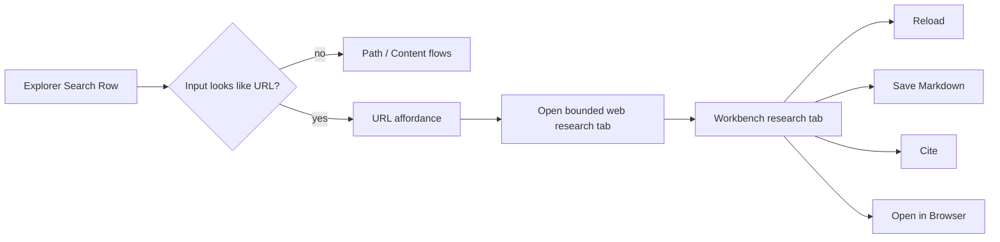

## Context

Agency already has a bounded URL research flow:
- Explorer can distinguish `URL` mode from `Paths` and `Content`;
- URL inspection uses the host excerpt pipeline and bounded handoff actions;
- the current host surface is still the Explorer primary panel area.

This is good enough to prove the workflow, but it is not the right long-term host.

The main product question is no longer "should Agency support bounded web research?"

That answer is already yes.

The real question is:
- where should that work live once the user starts working with a URL?

The answer should align with Agency's surface roles:
- Explorer is for intake, scope, reveal, and file-system truth;
- Workbench is for focused object work;
- the system browser remains the full-browser escape hatch.

## Goals

- Keep URL discovery and shortest-path trigger inside Explorer.
- Move the actual bounded web research work surface into a first-class Workbench tab kind.
- Keep the research tab bounded to research/document workflow rather than browser-product behavior.
- Keep save/cite/handoff actions inside the hosted page surface so users do not bounce back to the sidebar for primary actions.
- Support URL-aware affordances in the shared Explorer search row when the typed query already looks like a URL.

## Non-Goals

- Do not introduce a general-purpose in-app browser.
- Do not add browser-global tab management, cookie/session management, login persistence, download management, or arbitrary browsing chrome.
- Do not replace the system-browser escape hatch.
- Do not introduce a second parallel research state outside the bounded workbench document model.

## Decisions

### Decision: Explorer remains intake, not the long-lived host

Explorer is still the right place to:
- switch search intent;
- detect URL-like input;
- launch the bounded research flow;
- preserve working-set and project context.

Explorer is not the right place to host prolonged reading and action-taking once the user is actively working with a URL.

That belongs in Workbench.

### Decision: Model the hosted surface as a bounded Workbench document kind

The Workbench should host a bounded web research document/tab kind rather than pretending a remote URL is a file.

The Workbench tab model should remain explicit:
- local file tabs stay local file tabs;
- bounded web research tabs are their own kind with their own loader and rendering rules.

This avoids path fakery and keeps tab behavior explainable.

### Decision: The hosted view should default to bounded page/research rendering, not a browser product

The hosted tab may render live web content and/or a reader-oriented derivative, but it must remain a bounded research object.

The page-level actions should be:
- `Open in Browser`
- `Reload`
- `Save Markdown`
- `Cite`
- optional future `Reader / Live` mode switch if the implementation proves it is necessary

The hosted tab should not sprout:
- browser history controls beyond a bounded reload/open-external pattern unless explicitly justified;
- cookie managers;
- sign-in/session persistence UI;
- multi-tab browser chrome independent from Workbench.

### Decision: URL-aware affordance belongs in the shared Explorer search row

The shortest-path improvement should not create a second intake control.

Instead:
- when the current input looks like a public URL and the current working set supports URL research,
- the shared search row can surface a compact URL affordance such as a globe action or `Open as Web`,
- activating that affordance switches into the bounded web research tab flow.

This keeps one intake rail and preserves SSOT.

### Decision: Existing bounded research controller logic should be reused, not duplicated

The current URL inspection/handoff state machine already captures the important bounded-workflow pieces:
- normalized URL;
- preview;
- save/cite state;
- browser escape;
- error handling.

The refactor should move and rename these seams as needed so they are host-agnostic, then let both Explorer intake and Workbench host speak to the same bounded research document/controller model.

## Architecture Sketch

## Implementation Plan

### Phase 1: Contracts and host plumbing

- Extend the Workbench tab model with a bounded web research tab kind.
- Extract or rename the bounded research controller so it is not Explorer-panel-specific.
- Add a Workbench view/loader path for the new tab kind.
- Wire Explorer URL entry to open/focus the Workbench research tab instead of replacing the Explorer primary panel.

Exit criteria:
- one bounded tab kind exists in Workbench;
- Explorer can launch/focus it;
- the old Explorer-hosted research panel is removed from the main flow.

### Phase 2: Shortest-path affordance and page-level actions

- Add URL-aware affordance in the shared Explorer search row when the typed input resembles a URL.
- Move primary URL actions into the hosted Workbench tab chrome/content.
- Trim explanatory copy so the hosted page feels like a purposeful work surface, not a sidebar form transplanted into Workbench.

Exit criteria:
- users can type a URL in Explorer and reach the hosted Workbench tab with one obvious action;
- page-level actions live in the hosted tab rather than back in the sidebar.

### Phase 3: Verification and documentation

- Add regression tests for:
  - URL-aware affordance visibility;
  - Explorer intake -> Workbench tab transition;
  - bounded host actions staying available in the tab;
  - system-browser escape still working.
- Update spec, notes, README, manual verification, and reusable-items docs.

## Risks / Trade-offs

- A live page view may raise security/performance questions.
  - Mitigation: keep the host bounded, prefer clear process ownership, and explicitly reject general browser features.

- Workbench complexity could rise if the new tab kind is under-modeled.
  - Mitigation: add one explicit tab kind and loader path rather than letting remote URLs masquerade as files.

- Explorer shortest-path affordances could become noisy.
  - Mitigation: only surface them when the input actually looks like a supported public URL and the current surface supports URL research.

## Rejected Directions

- Keep the whole experience in Explorer:
  - rejected because the sidebar is the wrong host for prolonged reading and action-taking.

- Add a generic embedded browser to Workbench:
  - rejected because it would turn Agency into a browser product and weaken the bounded research contract.

- Treat URLs as fake file paths:
  - rejected because it muddies Workbench object semantics and makes persistence/behavior harder to reason about.
